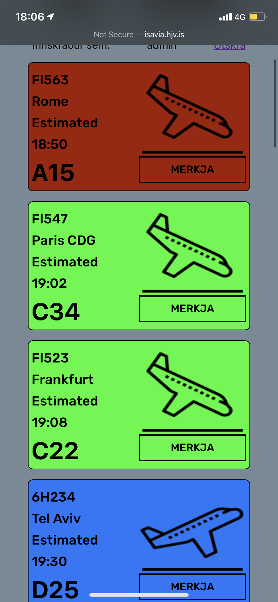
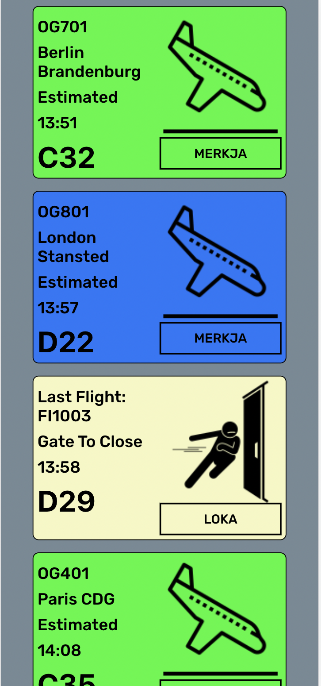
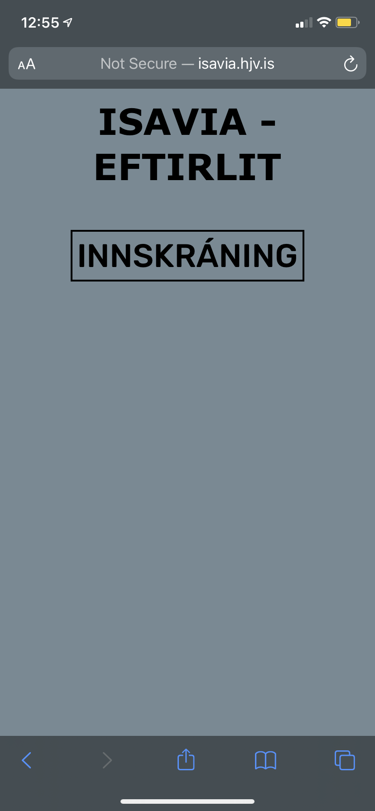
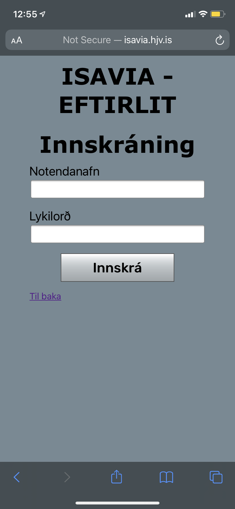

# Isavia - South #

Summer of 2022 I worked as Airport Security in Keflavík, Iceland. One of our routine assignments was configuring the gates for Schengen / Non-Schengen zones.

I made this small application to make the process easier for my shift.

* Flights/Gates are listed in ascending order by time
* Marked flights are centralized, that is if one person marks a flight,
  it will be marked for everyone else.

### Screenshots of Project ###

### DISCLAIMER ###

This application was never sold and thus I've decided to redact a lot of the code base, feel free to shoot any questions my way!

## Technical Stack ##

- JavaScript
- Embedded JavaScript templating
- Express
- Node.JS
- SCSS

- PostgreSQL
- Heroku

### Improvements ###

See room for improvements? Feel free to submit a pull request or shoot me a message!

> Version 1.0
